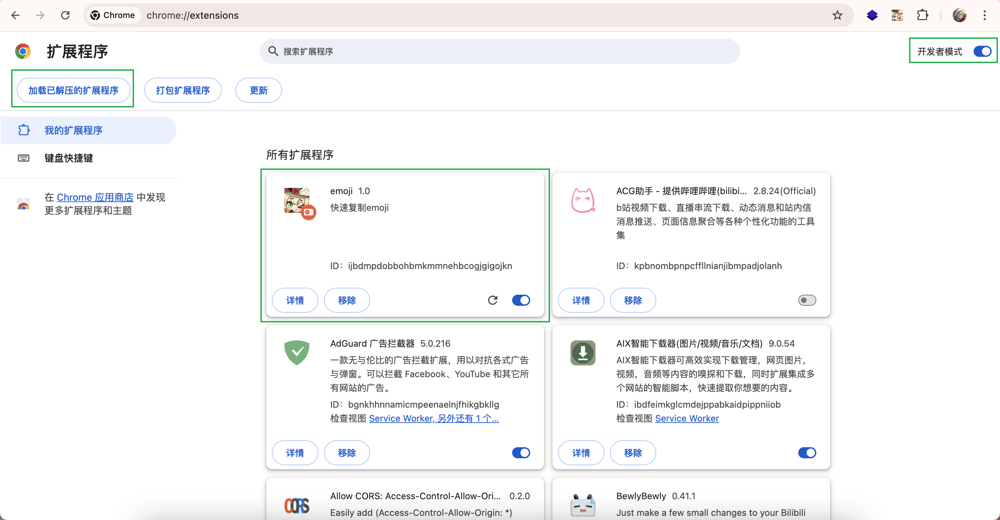

# Emoji_Chest

这个工具可以让你在 Linux do 回复, 发帖时快速插入自己的表情(emoji)!

2025 年 4 月 5 日 - 目前仅支持 chrome, 其他的浏览器和移动端还在研究.

## 结构目录

```
.
├── README.md           # 自述文件
├── chrome_pulgin       # chrome 插件
├── chrome_pulgin_vue   # vue, 如果你想要修改插件在这里修改
└── package             # 表情包
```

## 如何使用?

### 安装插件

首先你需要下载[chrome_pulgin.zip](https://github.com/sooooooooooooooooootheby/Emoji_Chest/releases/tag/p1.0.0), 将它解压出来, 放到一个你喜欢的地方, 只要你记得你放在哪就好.

然后打开 chrome => `chrome://extensions/`, 打开开发者模式, 点击加载已解压的拓展程序, 选择刚刚解压出来的文件夹导入.



点击地址拦旁边的插件图标, 打开插件列表, 点击图钉可以将插件入口固定在外面.


这样你就安装好插件了.

### 导入表情

假设你现在有一个表情包链接, 用下面这个链接举例.

```
https://gcore.jsdelivr.net/gh/sooooooooooooooooootheby/Emoji_Chest@v1.0.0/package/aurakingdom
```

将这个链接复制到插件窗口顶部的输入框, 然后点击`save`就可以了.

### 使用

当你在创建新话题或者在回复时直接点击某个 emoji 就能自动插入到输入框了.


## 创建自己的表情包

本插件的灵感来源于 Waline, 所以这个部分可以参考他的文档[创建自己的表情预设 ｜ Waline](https://waline.js.org/cookbook/customize/emoji.html)

### 创建库

1. 在你的 github 上创建一个库, 将这个库 clone 到你的设备上.
2. 进入目录, 在根目录创建一个文件夹, 这个文件夹将保存你的某个表情包.
3. 将你的表情包都放到这个文件夹中.
4. 在这个文件夹中创建一个配置文件`info.json`

假设我现在创建了一个库叫做`emoji`, 并且我创建了一个名为`s22y`的表情包目录, 并且我放了一些表情文件和配置文件, 那么现在的结构目录如下.

```
emoji
└── s22y
    ├── emoji1.png
    ├── emoji2.gif
    └── info.json
```

### 写配置文件

现在我们来写`info.json`配置文件.

下面的例子按照 Waline 的规范写的, 但是我们需要的只有`name`,`folder`, `items`这三个键.

```json
{
    "name": "",     # 表情包名
    "type": "",     # 此处留空, 作用是表情包的文件后缀
    "folder": "",   # 这里填下面获得的link
    "icon": "",     # 此处留空, 作用是在选项卡中展示的图标
    "items": [],    # 这里是你的所有表情名+文件后缀
}
```

`folder` 需要你预先写一下, 所以你要先看看下一步创建标签.

在 Waline 中`items`的内容是没有文件后缀的, 即`emoji1`, 但是这样会导致不支持多种格式的表情, 所以我移除了`type`键, 这样我们就需要添加上文件后缀, 即`emoji1.png`.

如果你还是云里雾里, 可以参考我的表情包, 它们位于`./package/`下.

### 创建github标签获取cdn link

打开你的 github 库, 创建一个 releases, tag 为`v1.0.0`.


这样, 你可以使用 cdn.jsdelivr.net 上带有版本的 CDN 链接作为你的 link.

格式为`https://cdn.jsdelivr.net/gh/<username>/<repo>@version/<emoji>`

按照前面的步骤, 现在我的 link 为: `https://cdn.jsdelivr.net/gh/sooooooooooooooooootheby/emoji@1.0.0/s22y`

> cdn.jsdelivr.net 可能在国内受到污染, 你可以将 cdn.jsdelivr.net 换成 gcore.jsdelivr.net, 或代理 cdn.jsdelivr.net 使用

写完配置文件再 push 一遍即可正常使用.

> 艹, 我做完了才发现我命名错误了, 我把 plugin 写成了 pulgin.
