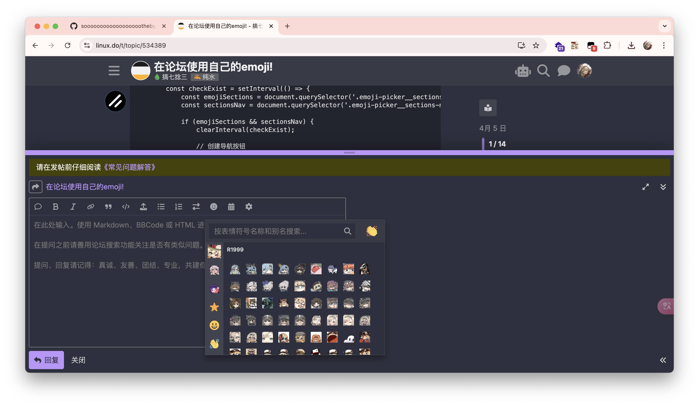

# Emoji_Chest

Emoji_Chest 的油猴插件篇.

修改自[在论坛使用自己的emoji!](https://linux.do/t/topic/534389?u=s22y).

油猴插件可以直接将表情列表插入L站的emoji列表中.

## 如何使用?

首先你需要下载[Emojer-0.1.1.user.js](https://github.com/sooooooooooooooooootheby/Emoji_Chest/releases/tag/p1.1.0), 导入到你的油猴中.

然后修改第37行的list数组, 按照[导入表情](https://github.com/sooooooooooooooooootheby/Emoji_Chest?tab=readme-ov-file#%E5%AF%BC%E5%85%A5%E8%A1%A8%E6%83%85)将表情包链接写到`list`数组中.

然后刷新L站打开emoji列表就能看到你自定义的表情包了.
